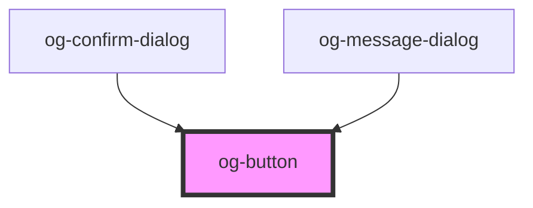

# og-button

<!-- Auto Generated Below -->

## Properties

| Property   | Attribute  | Description                                        | Type      | Default     |
| ---------- | ---------- | -------------------------------------------------- | --------- | ----------- |
| `disabled` | `disabled` | Determines, whether the control is disabled or not | `boolean` | `undefined` |
| `label`    | `label`    | The label of the button                            | `string`  | `undefined` |

## Events

| Event     | Description                                | Type               |
| --------- | ------------------------------------------ | ------------------ |
| `clicked` | Event is being emitted when value changes. | `CustomEvent<any>` |

## CSS Custom Properties

| Name                                | Description                                                                 |
| ----------------------------------- | --------------------------------------------------------------------------- |
| `--MinWidth`                        | Minimum width of the Button.                                                |
| `--og-button-Background`            | Main background color of the button                                         |
| `--og-button-Background--active`    | Background color when the button is clicked                                 |
| `--og-button-Background--disabled`  | Background color when the button is disabled                                |
| `--og-button-Background--hover`     | Background color when the button is hovered                                 |
| `--og-button-BorderColor`           | Main border color of the button                                             |
| `--og-button-BorderColor--active`   | Border color when the button is clicked                                     |
| `--og-button-BorderColor--disabled` | Border color when the button is disabled                                    |
| `--og-button-BorderColor--hover`    | Border color when the button is hovered                                     |
| `--og-button-BorderRadius`          | Border radius of the button                                                 |
| `--og-button-Color`                 | Text color of the button label                                              |
| `--og-button-Color--active`         | Text color when the button is clicked                                       |
| `--og-button-Color--disabled`       | Text color when the button is disabled                                      |
| `--og-button-Color--hover`          | Text color when the button is hovered                                       |
| `--og-button-WhiteSpace`            | White Space behavior of the Button text. Used to truncate overflowing text. |

## Dependencies

### Used by

 - [og-confirm-dialog](..\og-dialog\og-confirm-dialog)
 - [og-message-dialog](..\og-dialog\og-message-dialog)

### Graph

----------------------------------------------

*Built with [StencilJS](https://stenciljs.com/)*
