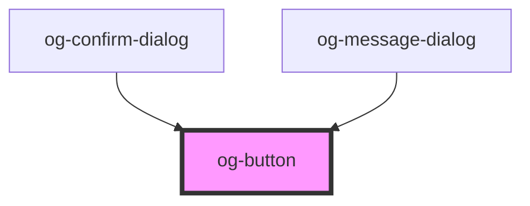

# og-button

<!-- Auto Generated Below -->

## Properties

| Property   | Attribute  | Description                                        | Type      | Default     |
| ---------- | ---------- | -------------------------------------------------- | --------- | ----------- |
| `disabled` | `disabled` | Determines, whether the control is disabled or not | `boolean` | `undefined` |
| `label`    | `label`    | The label of the button                            | `string`  | `undefined` |

## Events

| Event     | Description                                | Type                 |
| --------- | ------------------------------------------ | -------------------- |
| `clicked` | Event is being emitted when value changes. | `CustomEvent<Event>` |

## Dependencies

### Used by

 - [og-confirm-dialog](..\og-dialog\og-confirm-dialog)
 - [og-message-dialog](..\og-dialog\og-message-dialog)

### Graph

----------------------------------------------

*Built with [StencilJS](https://stenciljs.com/)*
