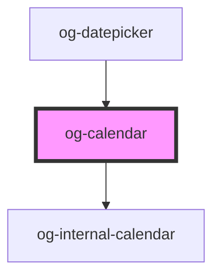

# og-calendar-group

This component is used by og-datepicker and is currently not intended for stand-alone use.

<!-- Auto Generated Below -->

## Properties

| Property           | Attribute            | Description | Type                 | Default                    |
| ------------------ | -------------------- | ----------- | -------------------- | -------------------------- |
| `dateDecorator`    | --                   |             | `OgDateDecorator`    | `undefined`                |
| `displayedMonths`  | `displayed-months`   |             | `number`             | `1`                        |
| `loc`              | `loc`                |             | `string`             | `getDefaultLocale()`       |
| `month`            | `month`              |             | `number`             | `new Date().getMonth()`    |
| `selection`        | --                   |             | `OgCalendarDate[]`   | `[]`                       |
| `selectionType`    | `selection-type`     |             | `"none" \| "single"` | `'single'`                 |
| `showCalendarWeek` | `show-calendar-week` |             | `boolean`            | `true`                     |
| `year`             | `year`               |             | `number`             | `new Date().getFullYear()` |

## Events

| Event              | Description | Type                            |
| ------------------ | ----------- | ------------------------------- |
| `dateClicked`      |             | `CustomEvent<OgCalendarDate>`   |
| `selectionChanged` |             | `CustomEvent<OgCalendarDate[]>` |

## Dependencies

### Used by

 - [og-datepicker](../og-datepicker)

### Depends on

- [og-internal-calendar](../og-internal-calendar)

### Graph

----------------------------------------------

*Built with [StencilJS](https://stenciljs.com/)*
