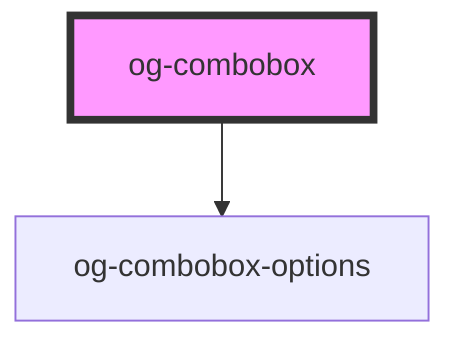

# og-combobox

<!-- Auto Generated Below -->

## Properties

| Property            | Attribute             | Description                                                         | Type      | Default     |
| ------------------- | --------------------- | ------------------------------------------------------------------- | --------- | ----------- |
| `disabled`          | `disabled`            | Determines, whether the control is disabled or not                  | `boolean` | `undefined` |
| `itemLabelProperty` | `item-label-property` | Set the property for the items to define as label. Default: "label" | `string`  | `'label'`   |
| `itemValueProperty` | `item-value-property` | Set the property for the items to define as value. Default: "value" | `string`  | `'value'`   |
| `items`             | --                    | An array of items to choose from                                    | `any[]`   | `undefined` |
| `placeholder`       | `placeholder`         | Optional placeholder if no value is selected.                       | `string`  | `undefined` |
| `value`             | `value`               | The selected value of the combobox                                  | `string`  | `undefined` |

## Events

| Event          | Description                                    | Type                      |
| -------------- | ---------------------------------------------- | ------------------------- |
| `focusGained`  | Event is being emitted when input gets focus.. | `CustomEvent<FocusEvent>` |
| `focusLost`    | Event is being emitted when focus gets lost.   | `CustomEvent<FocusEvent>` |
| `itemSelected` | Event is being emitted when value changes.     | `CustomEvent<any>`        |

## CSS Custom Properties

| Name                                   | Description                             |
| -------------------------------------- | --------------------------------------- |
| `--og-combobox-Background`             | Main background color of the combobox   |
| `--og-combobox-BorderColor`            | Main border color of the combobox       |
| `--og-combobox-BorderStyle`            | Main border style of the combobox       |
| `--og-combobox-BorderWidth`            | Main border width of the combobox       |
| `--og-combobox-Color`                  | Text color of the combobox              |
| `--og-combobox-FontSize`               | Font size of the combobox label         |
| `--og-combobox-Opacity`                | Overall opacity of the combobox         |
| `--og-combobox-Outline`                | Outline of the combobox                 |
| `--og-combobox-Padding`                | Padding (inner spacing) of the combobox |
| `--og-combobox__button__arrow-Height`  | Height of the toggle icon               |
| `--og-combobox__button__arrow-Padding` | Padding of the toggle icon              |
| `--og-combobox__button__arrow-Width`   | Width of the toggle icon                |
| `--og-combobox__indicator-Background`  | Color of the focus indicator            |
| `--og-combobox__indicator-Height`      | Height of the focus indicator           |
| `--og-combobox__indicator-Width`       | Width of the focus indicator            |
| `--og-combobox__placeholder-Color`     | Text color of the placeholder           |

## Dependencies

### Depends on

- [og-combobox-options](..\og-combobox-options)

### Graph

----------------------------------------------

*Built with [StencilJS](https://stenciljs.com/)*
