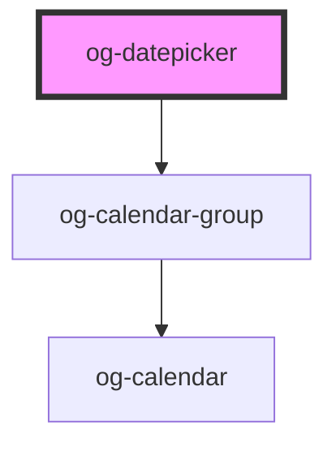

# og-datepicker

<!-- Auto Generated Below -->

## Properties

| Property        | Attribute     | Description                                        | Type              | Default              |
| --------------- | ------------- | -------------------------------------------------- | ----------------- | -------------------- |
| `dateDecorator` | --            |                                                    | `OgDateDecorator` | `undefined`          |
| `disabled`      | `disabled`    | Determines, whether the control is disabled or not | `boolean`         | `undefined`          |
| `format`        | `format`      |                                                    | `string`          | `'DD.MM.YYYY'`       |
| `loc`           | `loc`         |                                                    | `string`          | `getDefaultLocale()` |
| `placeholder`   | `placeholder` | Optional placeholder if no value is selected.      | `string`          | `undefined`          |
| `value`         | `value`       | The selected value of the combobox                 | `string`          | `undefined`          |

## Events

| Event          | Description                                    | Type                      |
| -------------- | ---------------------------------------------- | ------------------------- |
| `dateSelected` | Event is being emitted when value changes.     | `CustomEvent<any>`        |
| `focusGained`  | Event is being emitted when input gets focus.. | `CustomEvent<FocusEvent>` |
| `focusLost`    | Event is being emitted when focus gets lost.   | `CustomEvent<FocusEvent>` |

## Dependencies

### Depends on

- [og-calendar-group](..\og-calendar-group)

### Graph

----------------------------------------------

*Built with [StencilJS](https://stenciljs.com/)*
