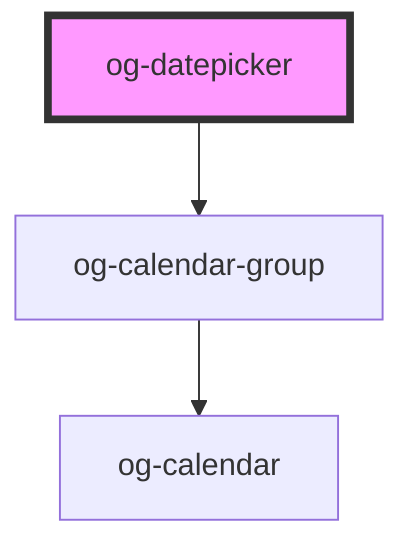

# og-datepicker

<!-- Auto Generated Below -->

## Properties

| Property        | Attribute     | Description                                                                                 | Type              | Default              |
| --------------- | ------------- | ------------------------------------------------------------------------------------------- | ----------------- | -------------------- |
| `dateDecorator` | --            | The date decorator can be used to highlight special dates like public holidays or meetings. | `OgDateDecorator` | `undefined`          |
| `disabled`      | `disabled`    | Determines, whether the control is disabled or not                                          | `boolean`         | `undefined`          |
| `format`        | `format`      | Defines the date string format. The value will be parsed and emitted using this format.     | `string`          | `'DD.MM.YYYY'`       |
| `loc`           | `loc`         | Locale for this datepicker (country code in ISO 3166 format)                                | `string`          | `getDefaultLocale()` |
| `placeholder`   | `placeholder` | Optional placeholder if no value is selected.                                               | `string`          | `undefined`          |
| `value`         | `value`       | The selected value of the combobox                                                          | `string`          | `undefined`          |

## Events

| Event          | Description                                        | Type                      |
| -------------- | -------------------------------------------------- | ------------------------- |
| `dateSelected` | Event is being emitted when selected date changes. | `CustomEvent<any>`        |
| `focusGained`  | Event is being emitted when input gets focus..     | `CustomEvent<FocusEvent>` |
| `focusLost`    | Event is being emitted when focus gets lost.       | `CustomEvent<FocusEvent>` |

## CSS Custom Properties

| Name                                               | Description                                |
| -------------------------------------------------- | ------------------------------------------ |
| `--og-datepicker-Background`                       | Main background color of the datepicker    |
| `--og-datepicker-BorderColor`                      | Main border color of the datepicker        |
| `--og-datepicker-BorderStyle`                      | Main border style of the datepicker        |
| `--og-datepicker-BorderWidth`                      | Main border width of the datepicker        |
| `--og-datepicker-Color`                            | Text color of the datepicker               |
| `--og-datepicker-FontSize`                         | Font size of the datepicker label          |
| `--og-datepicker-Opacity`                          | Overall opacity of the datepicker          |
| `--og-datepicker-Outline`                          | Outline of the datepicker                  |
| `--og-datepicker__button__arrow-Height`            | Height of the toggle icon                  |
| `--og-datepicker__button__arrow-Padding`           | Padding of the toggle icon                 |
| `--og-datepicker__button__arrow-Width`             | Width of the toggle icon                   |
| `--og-datepicker__flyout-Background`               | Background color of the datepicker list    |
| `--og-datepicker__flyout-BoxShadow`                | Shadow of the datepicker list              |
| `--og-datepicker__flyout__item-Background`         | Background color of list item              |
| `--og-datepicker__flyout__item-Background--active` | Background color of list item when clicked |
| `--og-datepicker__flyout__item-Background--hover`  | Background color of list item when hovered |
| `--og-datepicker__flyout__item-Color`              | Text color of the list item                |
| `--og-datepicker__indicator-Background`            | Color of the focus indicator               |
| `--og-datepicker__indicator-Height`                | Height of the focus indicator              |
| `--og-datepicker__indicator-Width`                 | Width of the focus indicator               |
| `--og-datepicker__placeholder-Color`               | Text color of the placeholder              |

## Dependencies

### Depends on

- [og-calendar-group](..\og-calendar-group)

### Graph

----------------------------------------------

*Built with [StencilJS](https://stenciljs.com/)*
