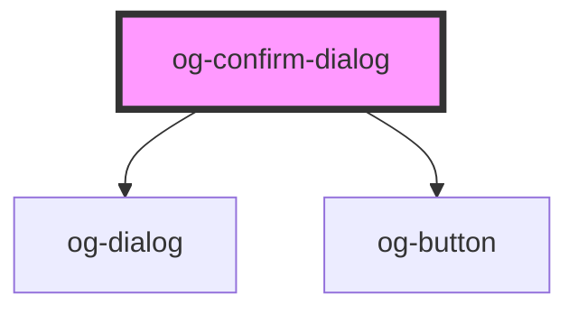

# og-confirm-dialog

<!-- Auto Generated Below -->

## Properties

| Property       | Attribute       | Description                      | Type      | Default                  |
| -------------- | --------------- | -------------------------------- | --------- | ------------------------ |
| `cancelLabel`  | `cancel-label`  | Label for cancel button.         | `string`  | `'Cancel'`               |
| `confirmLabel` | `confirm-label` | Label for confirmation button.   | `string`  | `'OK'`                   |
| `name`         | `name`          | The title for this modal dialog  | `string`  | `undefined`              |
| `svgIcon`      | `svg-icon`      | Optional SVG Icon as markup.     | `string`  | `SVGContent['question']` |
| `visible`      | `visible`       | Visibility state of this dialog. | `boolean` | `false`                  |

## Events

| Event       | Description                                | Type                 |
| ----------- | ------------------------------------------ | -------------------- |
| `cancelled` | Event is being emitted when value changes. | `CustomEvent<Event>` |
| `confirmed` | Event is being emitted when value changes. | `CustomEvent<Event>` |

## Dependencies

### Depends on

- [og-dialog](..)
- [og-button](..\..\og-button)

### Graph

----------------------------------------------

*Built with [StencilJS](https://stenciljs.com/)*
