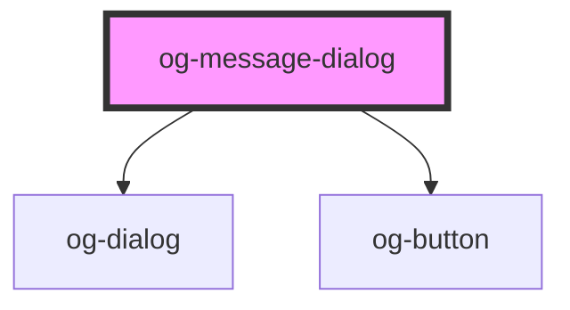

# og-success-dialog

<!-- Auto Generated Below -->

## Properties

| Property       | Attribute       | Description                                                                                                                  | Type                                          | Default     |
| -------------- | --------------- | ---------------------------------------------------------------------------------------------------------------------------- | --------------------------------------------- | ----------- |
| `approveLabel` | `approve-label` | Label for approve button.                                                                                                    | `string`                                      | `'OK'`      |
| `name`         | `name`          | The title for this modal dialog                                                                                              | `string`                                      | `undefined` |
| `svgIcon`      | `svg-icon`      | Optional SVG Icon as markup.                                                                                                 | `string`                                      | `undefined` |
| `type`         | `type`          | Dialog type can be: success / warning / error / info with. An icon as well as the icon color will be automatically assigned. | `"error" \| "info" \| "success" \| "warning"` | `'success'` |
| `visible`      | `visible`       | Visibility state of this dialog.                                                                                             | `boolean`                                     | `false`     |

## Events

| Event       | Description                                | Type               |
| ----------- | ------------------------------------------ | ------------------ |
| `confirmed` | Event is being emitted when value changes. | `CustomEvent<any>` |

## Dependencies

### Depends on

- [og-dialog](..)
- [og-button](../../og-button)

### Graph

----------------------------------------------

*Built with [StencilJS](https://stenciljs.com/)*
