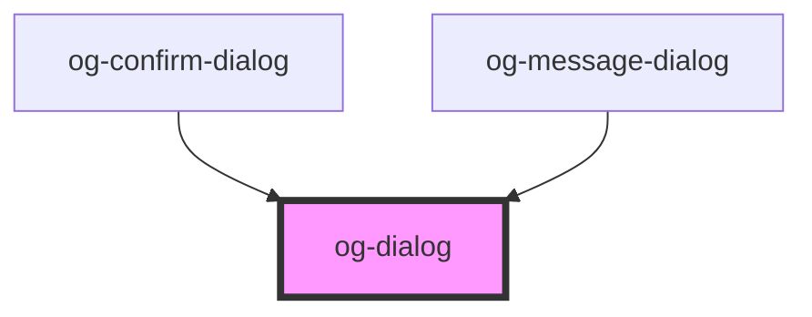

# og-dialog

<!-- Auto Generated Below -->

## Properties

| Property  | Attribute  | Description                                      | Type      | Default     |
| --------- | ---------- | ------------------------------------------------ | --------- | ----------- |
| `name`    | `name`     | The title for this modal dialog.                 | `string`  | `undefined` |
| `svgIcon` | `svg-icon` | SVG markup that can be styled by orgenic themes. | `string`  | `undefined` |
| `visible` | `visible`  | Visibility state of this dialog.                 | `boolean` | `false`     |

## CSS Custom Properties

| Name                                | Description                                                  |
| ----------------------------------- | ------------------------------------------------------------ |
| `--og-dialog--error__svg-Color`     | Color of the Dialog Content Img when inside 'Dialog Error'   |
| `--og-dialog--info__svg-Color`      | Color of the Dialog Content Img when inside 'Dialog Info'    |
| `--og-dialog--success__svg-Color`   | Color of the Dialog Content Img when inside 'Dialog Success' |
| `--og-dialog--warning__svg-Color`   | Color of the Dialog Content Img when inside 'Dialog Warning' |
| `--og-dialog-Background`            | Background of the Dialog                                     |
| `--og-dialog-BorderRadius`          | Corner Radius of the Dialog                                  |
| `--og-dialog-BoxShadow`             | Box Shadow of the Dialog Header                              |
| `--og-dialog-Height`                | Height of the Dialog                                         |
| `--og-dialog-MaxHeight`             | Max Height of the Dialog                                     |
| `--og-dialog-MaxWidth`              | Max Width of the Dialog                                      |
| `--og-dialog-Width`                 | Width of the Dialog                                          |
| `--og-dialog__content-Padding`      | Padding for the Dialog Content                               |
| `--og-dialog__footer-background`    | Background of the Dialog Footer                              |
| `--og-dialog__footer-Padding`       | Inner Space of the Dialog Footer                             |
| `--og-dialog__header-BorderColor`   | Border Color of the Dialog Header (all 4 sides)              |
| `--og-dialog__header-BorderStyle`   | Border Style of the Dialog Header (all 4 sides)              |
| `--og-dialog__header-BorderWidth`   | Border Width of the Dialog Header (all 4 sides)              |
| `--og-dialog__header-Display`       | Box Model of the Dialog Header                               |
| `--og-dialog__header-FontSize`      | Font Size of the Dialog Header                               |
| `--og-dialog__header-FontWeight`    | Font Weight of the Dialog Header                             |
| `--og-dialog__header-Margin`        | Margin of the Dialog Header                                  |
| `--og-dialog__header-Padding`       | Padding of the Dialog Header                                 |
| `--og-dialog__header-TextOverflow`  | Text Overflow Behavior of the Dialog Header                  |
| `--og-dialog__header-TextTransform` | Text Transformation of the Dialog Header                     |
| `--og-dialog__overlay-Background`   | Background of the Dialog Overlay.                            |
| `--og-dialog__svg-Background`       | Background of the Dialog Content Img                         |
| `--og-dialog__svg-BorderRadius`     | Corner Radius of the Dialog Content Img                      |
| `--og-dialog__svg-Color`            | Color of the Dialog Content Img                              |
| `--og-dialog__svg-container-Width`  | Width of the Container around Dialog Content Img             |
| `--og-dialog__svg-Display`          | Box Model of the Dialog Content Img                          |
| `--og-dialog__svg-Height`           | Height of the Dialog Content Img                             |
| `--og-dialog__svg-Margin`           | Outer Space of the Dialog Content Img                        |
| `--og-dialog__svg-Padding`          | Inner Space of the Dialog Content Img                        |
| `--og-dialog__svg-Width`            | Width of the Dialog Content Img                              |

## Dependencies

### Used by

 - [og-confirm-dialog](og-confirm-dialog)
 - [og-message-dialog](og-message-dialog)

### Graph

----------------------------------------------

*Built with [StencilJS](https://stenciljs.com/)*
