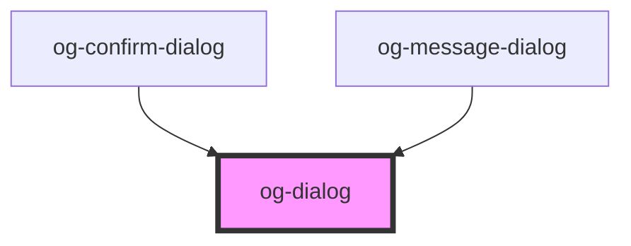

# og-dialog

<!-- Auto Generated Below -->

## Properties

| Property  | Attribute  | Description                                      | Type      | Default     |
| --------- | ---------- | ------------------------------------------------ | --------- | ----------- |
| `name`    | `name`     | The title for this modal dialog.                 | `string`  | `undefined` |
| `svgIcon` | `svg-icon` | SVG markup that can be styled by orgenic themes. | `string`  | `undefined` |
| `visible` | `visible`  | Visibility state of this dialog.                 | `boolean` | `false`     |

## Dependencies

### Used by

 - [og-confirm-dialog](og-confirm-dialog)
 - [og-message-dialog](og-message-dialog)

### Graph

----------------------------------------------

*Built with [StencilJS](https://stenciljs.com/)*
