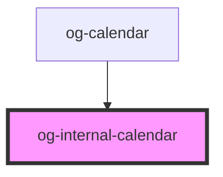

# og-calendar

This component is used by og-datepicker and is currently not intended for stand-alone use.

<!-- Auto Generated Below -->

## Properties

| Property           | Attribute            | Description | Type               | Default                    |
| ------------------ | -------------------- | ----------- | ------------------ | -------------------------- |
| `dateDecorator`    | --                   |             | `OgDateDecorator`  | `undefined`                |
| `loc`              | `loc`                |             | `string`           | `getDefaultLocale()`       |
| `month`            | `month`              |             | `number`           | `new Date().getMonth()`    |
| `selection`        | --                   |             | `OgCalendarDate[]` | `undefined`                |
| `showCalendarWeek` | `show-calendar-week` |             | `boolean`          | `true`                     |
| `year`             | `year`               |             | `number`           | `new Date().getFullYear()` |

## Events

| Event         | Description | Type               |
| ------------- | ----------- | ------------------ |
| `dateClicked` |             | `CustomEvent<any>` |

## Dependencies

### Used by

 - [og-calendar](../og-calendar)

### Graph

----------------------------------------------

*Built with [StencilJS](https://stenciljs.com/)*
