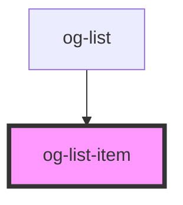

# og-list-item

<!-- Auto Generated Below -->

## Properties

| Property     | Attribute     | Description                                                                           | Type      | Default     |
| ------------ | ------------- | ------------------------------------------------------------------------------------- | --------- | ----------- |
| `image`      | `image`       | Set the url of the image to be shown in the placeholder                               | `string`  | `undefined` |
| `isDisabled` | `is-disabled` | Set the flag, it this list item is in disabled state.                                 | `boolean` | `undefined` |
| `isSelected` | `is-selected` | Set the flag, if this list item is in selected state.                                 | `boolean` | `undefined` |
| `key`        | `key`         | The value is needed for the using @see OgList instance to correctly handle selection. | `any`     | `undefined` |
| `label`      | `label`       | Sets the value of the label.                                                          | `string`  | `undefined` |
| `showImage`  | `show-image`  | Set flag, if place for an image is reserved, wheather used or not.                    | `boolean` | `undefined` |
| `showValue`  | `show-value`  | Set flag, if place for a value bage is reserved wheather used or not                  | `boolean` | `undefined` |
| `value`      | `value`       | Set the value to be shown in the badge placeholder                                    | `string`  | `undefined` |

## Dependencies

### Used by

 - [og-list](..\og-list)

### Graph

----------------------------------------------

*Built with [StencilJS](https://stenciljs.com/)*
