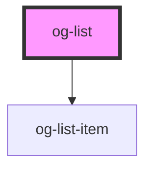

# og-list

<!-- Auto Generated Below -->

## Properties

| Property           | Attribute            | Description                                                                                                 | Type                 | Default                |
| ------------------ | -------------------- | ----------------------------------------------------------------------------------------------------------- | -------------------- | ---------------------- |
| `disabled`         | `disabled`           | Determines, whether the control is disabled or not                                                          | `boolean`            | `undefined`            |
| `disabledProperty` | `disabled-property`  | Set the property for the items to define as disabled. Default: 'disabled'                                   | `string`             | `'disabled'`           |
| `emptyListMessage` | `empty-list-message` | Set the text that will be displayed if the items array is empty.                                            | `string`             | `'No items available'` |
| `imageUrlProperty` | `image-url-property` | Set the property for the items to define as image url. *Optional* Default: no image                         | `string`             | `undefined`            |
| `items`            | --                   | An array of items to choose from                                                                            | `any[]`              | `undefined`            |
| `keyProperty`      | `key-property`       | Set the property for the items to define as value. Default: 'key'                                           | `string`             | `'key'`                |
| `labelProperty`    | `label-property`     | Set the property for the items to define as label. Default: 'label'                                         | `string`             | `'label'`              |
| `multiselect`      | `multiselect`        | Enables selection of multiple items                                                                         | `boolean`            | `undefined`            |
| `required`         | `required`           | Requires a selection of at least one item. If one item is selected it prevents the user from deselecting it | `boolean`            | `undefined`            |
| `selected`         | `selected`           | The key of the selected list item                                                                           | `string \| string[]` | `undefined`            |
| `valueProperty`    | `value-property`     | Set the property for the items to define as value. *Optional* Default: no value                             | `string`             | `undefined`            |

## Events

| Event          | Description                                | Type               |
| -------------- | ------------------------------------------ | ------------------ |
| `itemSelected` | Event is being emitted when value changes. | `CustomEvent<any>` |

## CSS Custom Properties

| Name                          | Description                                |
| ----------------------------- | ------------------------------------------ |
| `--og-list-Opacity`           | Overall opacity of the list                |
| `--og-list-Opacity--disabled` | Overall opacity of the list when disabled. |

## Dependencies

### Depends on

- [og-list-item](..\og-list-item)

### Graph

----------------------------------------------

*Built with [StencilJS](https://stenciljs.com/)*
