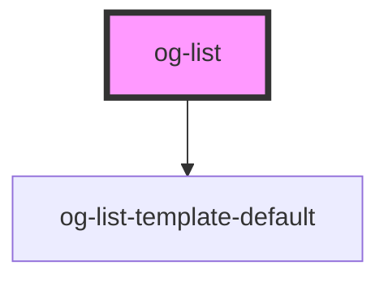

# og-list

<!-- Auto Generated Below -->

## Properties

| Property           | Attribute            | Description                                                                                                 | Type                 | Default                                                |
| ------------------ | -------------------- | ----------------------------------------------------------------------------------------------------------- | -------------------- | ------------------------------------------------------ |
| `disabled`         | `disabled`           | Determines, whether the control is disabled or not                                                          | `boolean`            | `undefined`                                            |
| `emptyListMessage` | `empty-list-message` | Set the text that will be displayed if the items array is empty.                                            | `string`             | `'No items available'`                                 |
| `items`            | --                   | An array of items to choose from                                                                            | `any[]`              | `undefined`                                            |
| `multiselect`      | `multiselect`        | Enables selection of multiple items                                                                         | `boolean`            | `undefined`                                            |
| `required`         | `required`           | Requires a selection of at least one item. If one item is selected it prevents the user from deselecting it | `boolean`            | `undefined`                                            |
| `selected`         | `selected`           | Key(s) of the selected list item(s)                                                                         | `string \| string[]` | `undefined`                                            |
| `template`         | `template`           |                                                                                                             | `string`             | `'default'`                                            |
| `templateOptions`  | `template-options`   |                                                                                                             | `any`                | `{ key: 'key', label: 'label', disabled: 'disabled' }` |

## Events

| Event          | Description                                | Type               |
| -------------- | ------------------------------------------ | ------------------ |
| `itemSelected` | Event is being emitted when value changes. | `CustomEvent<any>` |

## CSS Custom Properties

| Name                          | Description                               |
| ----------------------------- | ----------------------------------------- |
| `--og-list-Opacity`           | Overall opacity of the list               |
| `--og-list-Opacity--disabled` | Overall opacity of the list when disabled |

## Dependencies

### Depends on

- [og-list-template-default](..\og-list-template-default)

### Graph

----------------------------------------------

*Built with [StencilJS](https://stenciljs.com/)*
