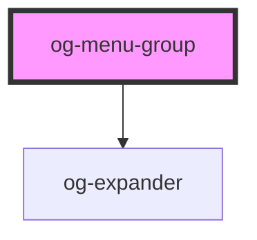

# og-menu-group

<!-- Auto Generated Below -->

## Properties

| Property      | Attribute     | Description | Type      | Default     |
| ------------- | ------------- | ----------- | --------- | ----------- |
| `collapsible` | `collapsible` |             | `boolean` | `false`     |
| `name`        | `name`        |             | `string`  | `undefined` |

## Dependencies

### Depends on

- [og-expander](..\og-expander)

### Graph

----------------------------------------------

*Built with [StencilJS](https://stenciljs.com/)*
