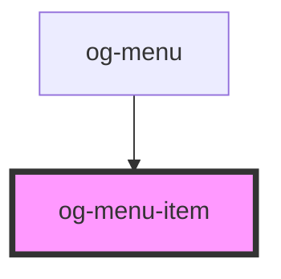

# og-menu-item

<!-- Auto Generated Below -->

## Properties

| Property   | Attribute  | Description                                          | Type           | Default     |
| ---------- | ---------- | ---------------------------------------------------- | -------------- | ----------- |
| `disabled` | `disabled` | Determines, whether the menu item is disabled or not | `boolean`      | `undefined` |
| `itemId`   | `item-id`  | The unique id of the menu item                       | `string`       | `undefined` |
| `label`    | `label`    | The label of the menu item                           | `string`       | `undefined` |
| `subItems` | --         | Subitems of the menu item                            | `OgMenuItem[]` | `undefined` |

## Events

| Event     | Description                                | Type               |
| --------- | ------------------------------------------ | ------------------ |
| `clicked` | Event is being emitted when value changes. | `CustomEvent<any>` |

## Dependencies

### Used by

 - [og-menu](..\og-menu)

### Graph

----------------------------------------------

*Built with [StencilJS](https://stenciljs.com/)*
