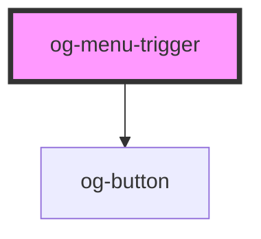

# og-menu-trigger

<!-- Auto Generated Below -->

## Properties

| Property     | Attribute     | Description                                             | Type      | Default        |
| ------------ | ------------- | ------------------------------------------------------- | --------- | -------------- |
| `disabled`   | `disabled`    | Determines, whether the menu trigger is disabled or not | `boolean` | `undefined`    |
| `labelClose` | `label-close` | The label of the menu trigger to close the menu         | `string`  | `'Close menu'` |
| `labelOpen`  | `label-open`  | The label of the menu trigger to open the menu          | `string`  | `'Open menu'`  |
| `menu`       | `menu`        | Determines, which menu is assigned to the trigger       | `string`  | `undefined`    |

## Dependencies

### Depends on

- [og-button](..\og-button)

### Graph

----------------------------------------------

*Built with [StencilJS](https://stenciljs.com/)*
