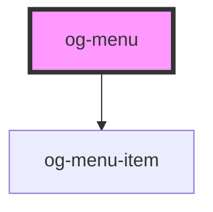

# og-menu

<!-- Auto Generated Below -->

## Properties

| Property  | Attribute | Description                                       | Type           | Default     |
| --------- | --------- | ------------------------------------------------- | -------------- | ----------- |
| `items`   | --        |                                                   | `OgMenuItem[]` | `undefined` |
| `name`    | `name`    | The name of the menu to be addressed by a trigger | `string`       | `undefined` |
| `visible` | `visible` | Determines, whether the menu is visible or not    | `boolean`      | `undefined` |

## Methods

### `toggleVisibility(visible?: boolean) => Promise<void>`

Method to toggle the visibility of the menu

#### Returns

Type: `Promise<void>`

## CSS Custom Properties

| Name                        | Description                       |
| --------------------------- | --------------------------------- |
| `--og-menu-BackgroundColor` | Main background color of the menu |

## Dependencies

### Depends on

- [og-menu-item](..\og-menu-item)

### Graph

----------------------------------------------

*Built with [StencilJS](https://stenciljs.com/)*
