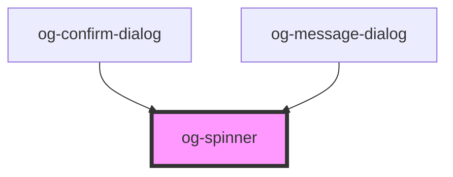

# og-spinner

<!-- Auto Generated Below -->

## Properties

| Property   | Attribute  | Description                                        | Type      | Default     |
| ---------- | ---------- | -------------------------------------------------- | --------- | ----------- |
| `disabled` | `disabled` | Determines, whether the control is disabled or not | `boolean` | `undefined` |
| `label`    | `label`    | The label of the spinner                            | `string`  | `undefined` |

## Events

| Event     | Description                                | Type               |
| --------- | ------------------------------------------ | ------------------ |
| `clicked` | Event is being emitted when value changes. | `CustomEvent<any>` |

## CSS Custom Properties

| Name                               | Description                                  |
| ---------------------------------- | -------------------------------------------- |
| `--og-spinner-Background`           | Main background color of the spinner          |
| `--og-spinner-Background--active`   | Background color when the spinner is clicked  |
| `--og-spinner-Background--disabled` | Background color when the spinner is disabled |
| `--og-spinner-Background--hover`    | Background color when the spinner is hovered  |
| `--og-spinner-BorderRadius`         | Border radius of the spinner                  |
| `--og-spinner-Color`                | Text color of the spinner label               |
| `--og-spinner-Color--active`        | Text color when the spinner is clicked        |
| `--og-spinner-Color--disabled`      | Text color when the spinner is disabled       |
| `--og-spinner-Color--hover`         | Text color when the spinner is hovered        |

## Dependencies

### Used by

 - [og-confirm-dialog](..\og-dialog\og-confirm-dialog)
 - [og-message-dialog](..\og-dialog\og-message-dialog)

### Graph

----------------------------------------------

*Built with [StencilJS](https://stenciljs.com/)*
